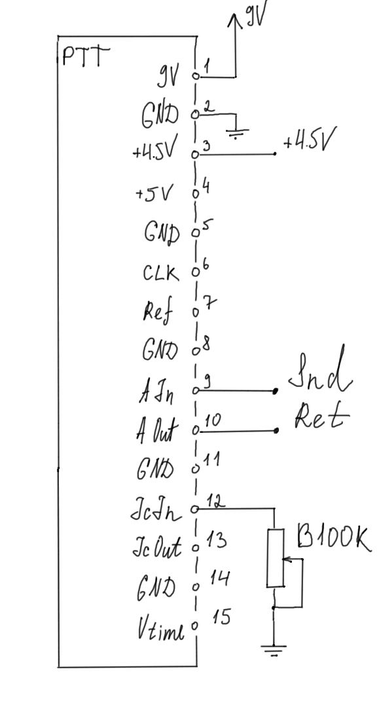
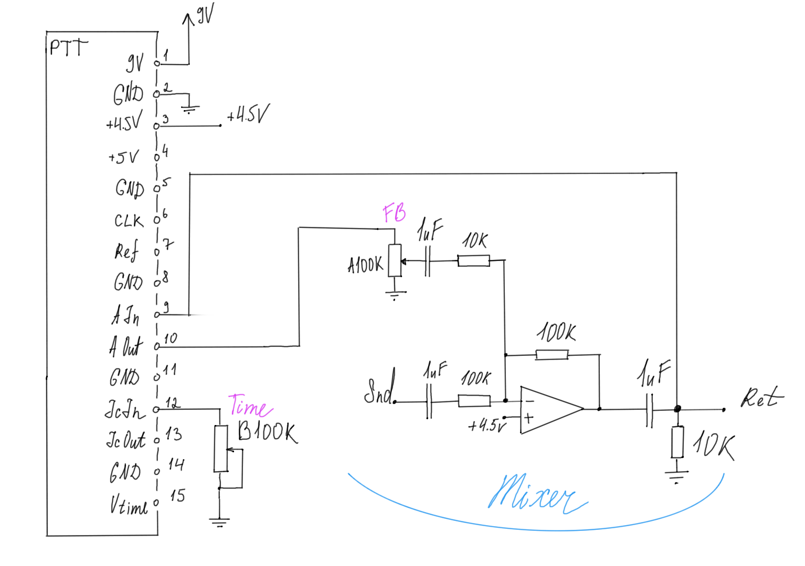

### PTT

PT2399 adapter board for prototyping pedals.

[Schematic](./ptt-v1rev2.pdf)

#### Pins

1. +9V (Input)
2. GND (Input)
3. +4.5 (Input)
4. +5.0V (Output of the on-board 5V regulator)
5. GND (Input)
6. CLK (Ouptut of the PT2399 Clock pin, #5 on the chip)
7. Ref (Output of the PT2399 Ref pin, #2 on the chip)
8. GND (Input)
9. A In (Input for the audio signal)
10. A Out (Output of the processed audio signal)
11. GND (Input)
12. Ic In (Input, this pin is connected to the VCO pin #6 on
    PT2399, it controls delay time, see below for details);
13. Ic Out (Output of the Voltage-to-Current converter);
14. GND;
15. Vtime (Input of the Voltage-to-Current converter).

For minimum operation, please connect these pins. Keep in
mind for duplicate pins like GND, it's sufficient to just
connect one of the pins.

* `Pin 1`: +9V;
* `Pin 2`: GND;
* `Pin 3`: +4.5V;
* `Pin 9`: Audio In;
* `Pin 10`: Audio Out;
* `Pin 12`: Ic In. This pin controls delay time, see below
  for details.

#### Control delay time via a pot

`Ic In` pin (#12) on the adapter board is hooked up directly
to the control pin on the PT2399. The easiest way to vary
delay time is to connect this pin to ground via a
potentiometer, e.g. B100k.

The larger the resistance to GND the longer the delay time.

The minimum necessary resistance to GND on PT2399 startup is
2k. Otherwise the chip latches up. [See details in this Electrosmash article.](https://www.electrosmash.com/pt2399-analysis)

#### Control delay time via voltage

It is possible to control delay time of this board using
voltage instead of a potentiometer. There's an onboard
voltage-to-current converter. To use it, send control
voltage via `Vtime` pin and get the control current via the
`Ic Out` pin. Connect `Ic Out` to `Ic In` to control delay
time using `Vtime`. The lower `Vtime` the longer the delay
time would be.

#### Example minimal delay circuit with repeats

